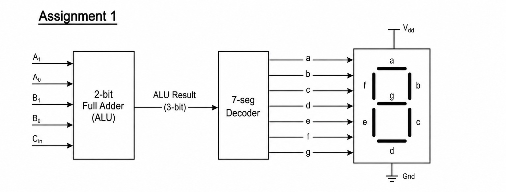

# 2-Bit ALU with 7-Segment Display Decoder

## Problem Statement

The goal of this project is to implement a structural 2-bit full adder (ALU) that takes inputs $A$, $B$, and $C_{in}$, outputs a 3-bit result, and passes it through a 7-segment decoder to drive a hardware display unit.

## System Architecture

* **full_add.v**: Gate-level full adder implementation.
* **adder_2bit.v**: Structural 2-bit adder using instantiated full adders.
* **bcd_deco.v**: Look-up table mapping 3-bit sums to 7-segment display codes.
* **top_system.v**: Top wrapper interconnecting the adder and decoder.

## RTL Schematic

Below is the synthesized hardware routing showing the direct bus connection between the adder blocks and the optimized ROM decoder:

## Verification & Simulation

The design functions correctly under all test combinations. The waveform demonstrates proper active-high segment encoding matching the mathematically computed values (e.g., Sum 0 = `7e`, Sum 2 = `6d`, Sum 4 = `33`, Sum 7 = `70`).

### Simulation Waveform

