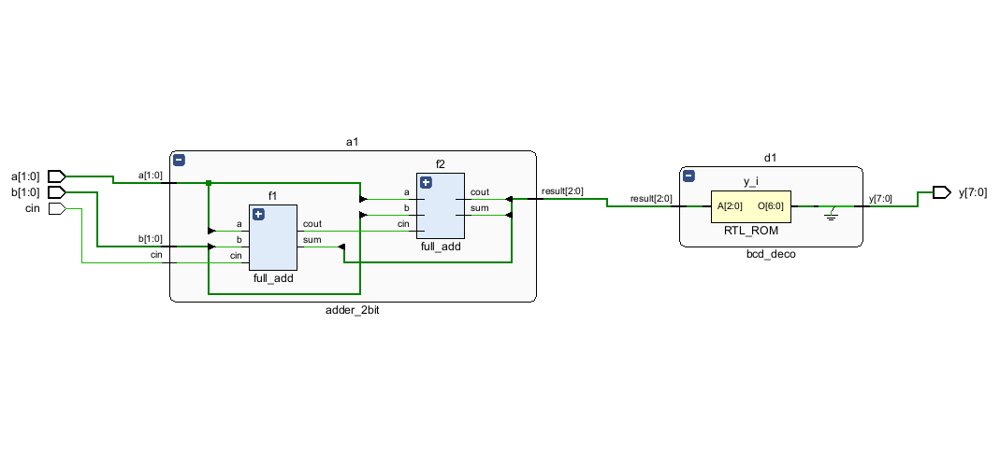
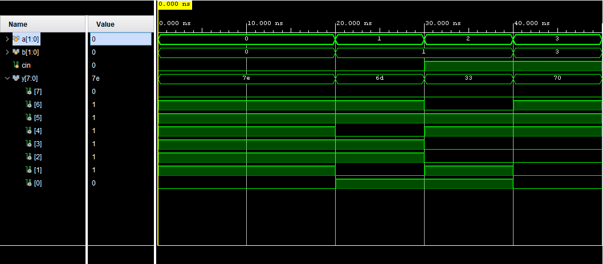

# 2-Bit ALU with 7-Segment Display Decoder

This project implements a 2-bit Ripple Carry Adder (ALU) connected to an 8-bit output 7-segment display decoder in Verilog. The entire system is modularly designed and fully verified via behavioral simulation.

## System Architecture

* **full_add.v**: Gate-level full adder implementation.
* **adder_2bit.v**: Structural 2-bit adder using instantiated full adders.
* **bcd_deco.v**: Look-up table mapping 3-bit sums to 7-segment display codes.
* **top_system.v**: Top wrapper interconnecting the adder and decoder.

## RTL Schematic

Below is the synthesized hardware routing showing the direct bus connection between the adder blocks and the optimized ROM decoder:

## Verification & Simulation

The design functions correctly under all test combinations. The waveform demonstrates proper active-high segment encoding matching the mathematically computed values (e.g., Sum 0 = `7e`, Sum 2 = `6d`, Sum 4 = `33`, Sum 7 = `70`).

### Simulation Waveform

